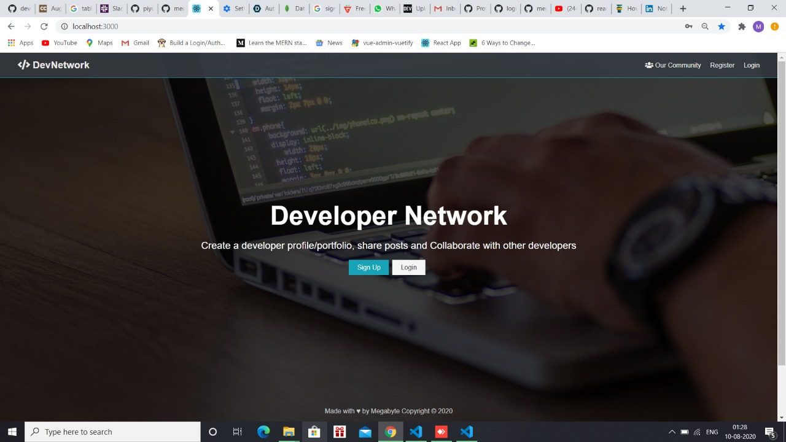
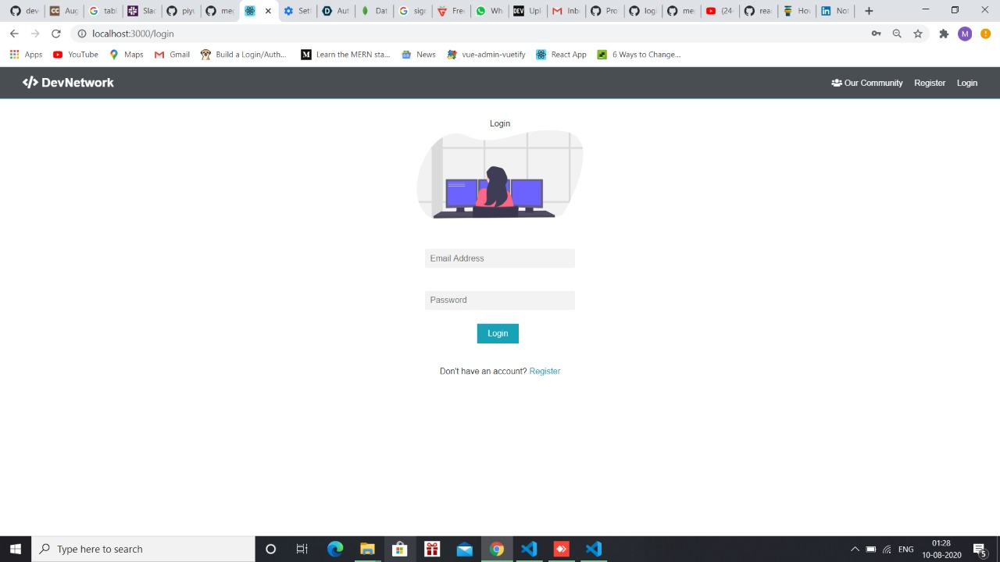
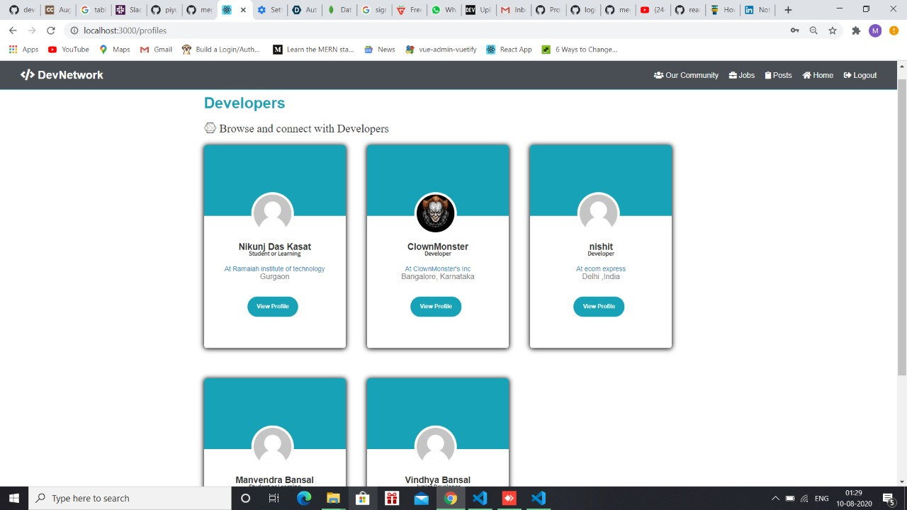
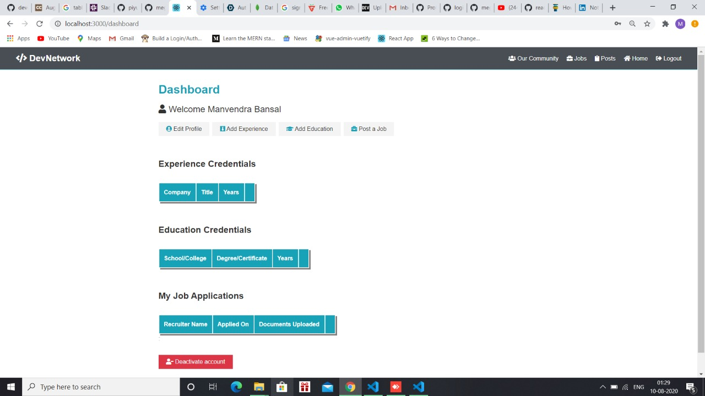
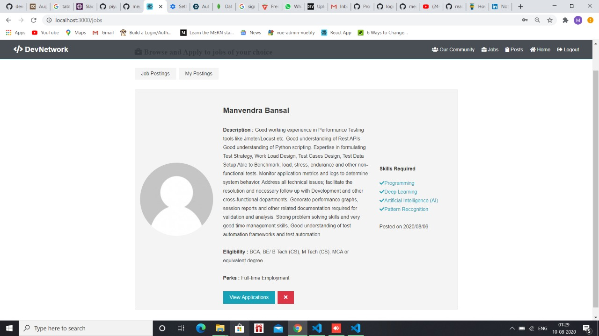
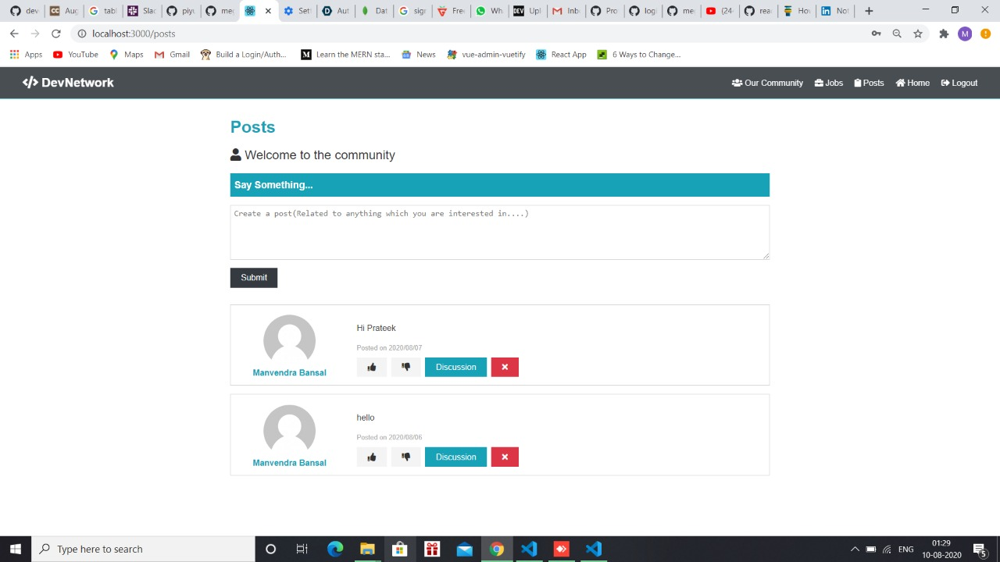

<h2 align="center">Developers Network</h2>

  

 

<h3>Abstract :</h3>
<h4>
It is a platform to connect developers across the community to share their projects and have collaborations for their projects with the interested ones and also discuss on topic of interest with fellow developers. Developers can also link their GitHub accounts and can showcase their projects so when other recruiters post their job offers they can easy filter out the developers and find the right one. The Developers section has all the developers profile where others can talk with them for collaborations or job offers. In Post sections, Developers can discuss about the topic of interest and if people can also post about programming things and get the solutions by starting a thread of conversation
</h4>

<h3>Snapshots:</h3>
 

 

<h3>Run Locally : <h3>
<h4>
  To run in development mode:
</h4>
<h5>1. Fork this repo and clone : https://github.com/megabyte98/auth0.git</h5>
<h5>2. Navigate to the root of the project.</h5>
<h5>3. Make sure you have yarn Node.js, npm & MongoDB installed in your system.</h5>
<h5>4. run : npm install.</h5>
<h5>5. navigate to client: cd client and run: npm install.</h5>
<h5>6. Navigate back to root of the project.</h5>
<h5>7. To run server: npm run server</h5>
<h5>8. To run frontend: npm run client</h5>
<h5>9. To run dynamically both frontend and backend: npm run dev</h5>

 
<h4>To run in productio mode: </h4>
<h5>Follow the above steps from 1-6</h5>
<h5>then run : npm build</h5>

 
<h3>Source code : </h3>
<h4>Get the source code of this project in zip format directly with the link : https://he-s3.s3.amazonaws.com/media/sprint/recruit-a-thon/team/870325/4c86ae4auth0.zip <h4>
